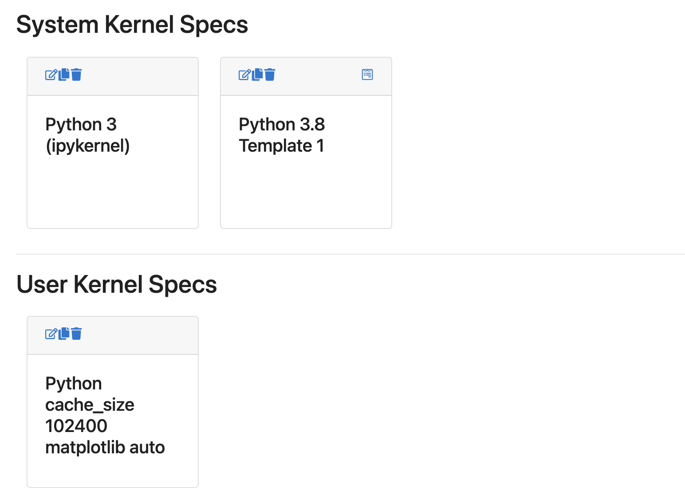
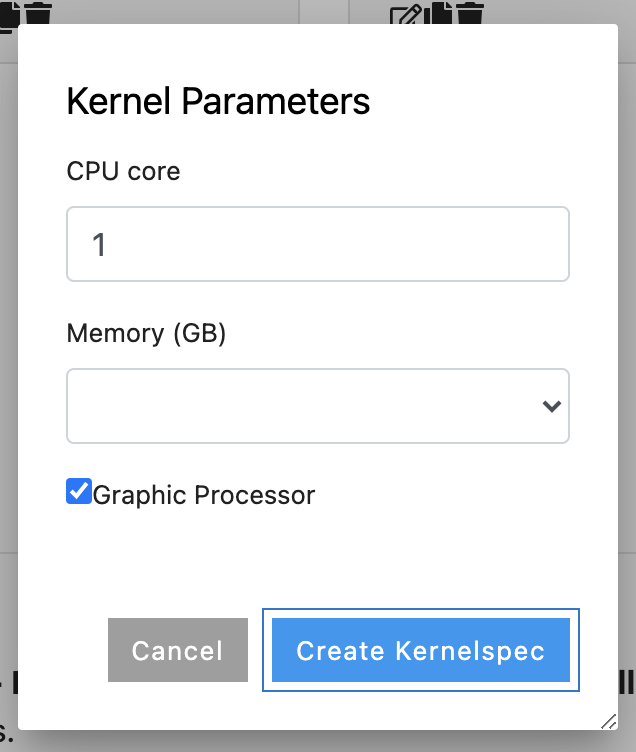
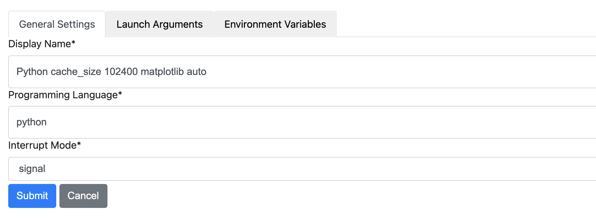
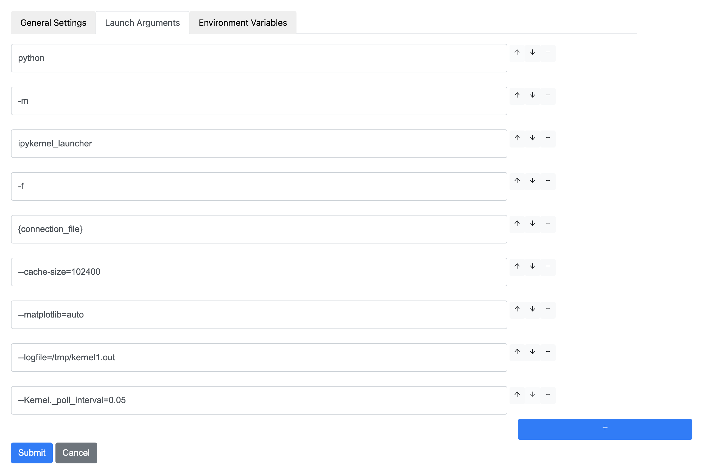

# Kernel Specification Manager JupyterLab Extension

> This JupyterLab Extension allows users to manage Kernelspecs from within JupyterLab.



`ksmm` is a temporary name, originally standing for `Kernelspec Manager` and currently ships:

- Kernelspec creation based on parametrized templates.
- Kernelspec Editing: name, attributes.
- Kernel Duplication. 
- Kernel Deletion.

## Context

On large distributed systems, it is common to wish to parametrize kernels and choose parameters for a remote environment, like number of CPU, Memory limit, presence of GPU. Or even set other parameters in environment variables.

This currently requires to create a new Kernelspec for jupyter using the command line which can be a tedious and complicated task.

Modifying existing Kernelspec also does not always works as they are cached on a per notebook.

This is an attempt to provide a UI based on json-schema and templates, for end users to easily create, duplicate and modify kernelspec, without being exposed to _too much_ of the internal details.

## Install Kernelspecs Templates

You will need [Kernelspec templates](#about-kernelspec-templates).

```bash
make install-kernelspecs
```

This will install the `python-template-1` Kernelspec example located in the examples folder.

## Install from a Release

Ensure you have JupyterLab 3.1+, and then run this command the ksmm extension inside your current JupyterLab environment.

```bash
pip install --upgrade ksmm
```

## Develop

Use the provided `environment.yaml` to install the conda environment.

```base
conda deactivate && \
  make env-rm && \
  make env
conda activate ksmm
```

```python
# Install the server and frontend in dev mode.
make install-dev
```

```python
# In terminal 1, Start the jupyterlab.
# open http://localhost:8234?token=...
make jlab
```

```python
# In terminal 2, start the extension building in watch mode.
make watch
```

When making changes to the extension you will need to issue a `jupyter labextension build`, or, start `jlpm run watch` in the root of the repository to rebuild on every changes. You do not need to restart or rebuild JupyterLab for changes on the frontend extensions, but do need to restart the server for changes to the Python code.

## About Kernelspec Templates

You system adminstrator can create Kernelspect templates for you. As a user, if you click on the picker icon of a template card, you will be prompted for the Kernelspec parameters.



When you will click on the `Create Kernelspec` button, a new Kernespec will be created.

This is an example of such a Kernelspec template. The `metadata/template/tpl` stanza should contain a [Json Schema](https://json-schema.org) compliant structure. You can browser the [react-jsonschema-form](https://rjsf-team.github.io/react-jsonschema-form) for examples.

You can use the `metadata/template/mapping` stanza to create visual mappings (e.g. `Small` will be mapped to `102400`).

```json
{
  "argv": [
    "slurm",
    "run",
    "--mem=1048576000",
    "--cpu=14",
    "python3.8",
    "-m",
    "ipykernel",
    "-f",
    "{connection_file}"
  ],
  "display_name": "Python 3.8 Template 1",
  "language": "python",
  "metadata": {
    "template": {
      "tpl": {
        "argv": [
          "slurm",
          "run",
          "--mem={mem_slurm}",
          "--cpu={cpu}",
          "python3.8",
          "-m",
          "ipykernel",
          "-f",
          "{connection_file}"
        ],
        "display_name": "Python 3.8 RAM:{mem}/ CPU={cpu} / {gpu}"
      },
      "parameters": {
        "cpu": {
          "type": "integer",
          "title": "CPU core",
          "default": 1,
          "maximum": 48,
          "minimum": 1
        },
        "mem": {
          "type": "string",
          "title": "Memory (GB)",
          "enum": [
            "Small",
            "Medium",
            "Big"
          ]
        },
        "gpu": {
          "type": "boolean",
          "title": "Graphic Processor",
          "default": true
        }
      },
      "mapping": {
        "mem_slurm": {
          "mem": {
            "Small": "102400",
            "Medium": "512000",
            "Big": "1048576000"
          }
        }
      }
    }
  }
}
```

## General Settings



## Launch Arguments


